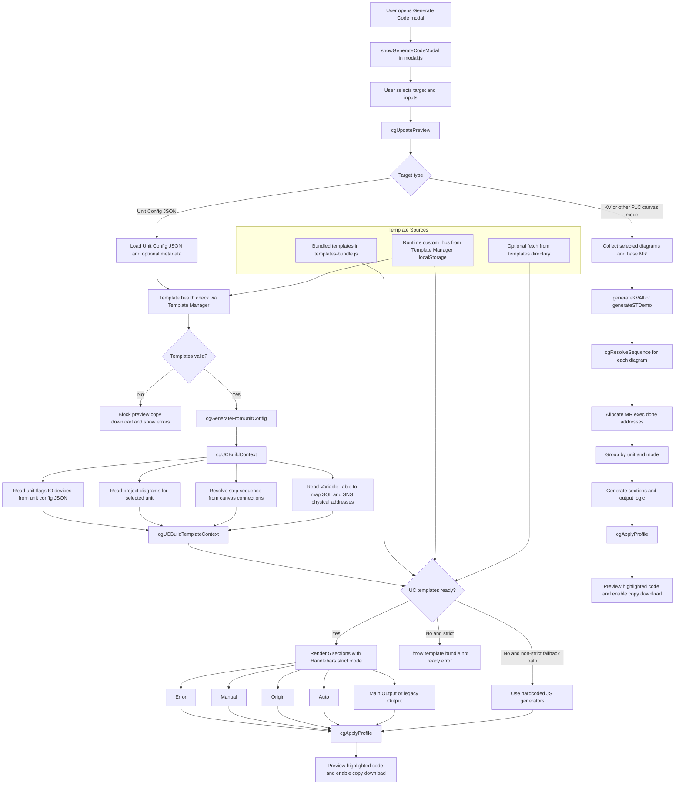

# Grafcet Studio — Unit Config Code Generator (v2)

## Kiến trúc tổng quan

Engine sinh IL code từ **2 nguồn kết hợp**:

| Nguồn | Nội dung |
|---|---|
| `infeed-unit.json` | Địa chỉ flags MR, HMI, sysManFlag, lock, errFlag của từng cylinder |
| Canvas diagrams | Thứ tự step, action (SOL), sensor (SNS) — do người dùng vẽ trong Grafcet Studio |

> **Nguyên tắc**: Canvas là nguồn duy nhất về thứ tự quy trình. JSON chỉ lưu phần cứng cố định.

---

## infeed-unit.json (v2)

```json
{
  "unit": {
    "label": "Infeed",
    "plcProfile": "kv-5500",
    "originBaseAddr": "@MR100",
    "autoBaseAddr":   "@MR300",
    "autoEndPulseAddr": "@MR011",
    "flags": { "flagOrigin":"@MR000", "flagAuto":"@MR001", ... },
    "io":    { "eStop":"MR103", "btnStart":"MR5000", ... }
  },
  "cylinders": [
    { "id":"CY1", "hmiManBtn":"MR1400", "sysManFlag":"MR1500",
      "lockDirA":"MR1200", "lockDirB":"MR1201",
      "errFlagDirA":"MR1600", "errFlagDirB":"MR1601", "errorTimeout":500 }
  ]
}
```

**Không còn** trường `flows[]` — thứ tự bước lấy từ canvas.

---

## Quy ước Variable Table (canvas)

```
Output SOL : CY1.Up_SOL   = LR000      CY1.Down_SOL  = LR001
Sensor SNS : CY1.Up_SNS   = MR1000     CY1.Down_SNS  = MR1001
```

- `{CyId}.{Dir}_SOL` → output coil  
- `{CyId}.{Dir}_SNS` → sensor input  
- Step **action** = `CY1.Down_SOL` (qualifier N)  
- Transition **condition** = `CY1.Down_SNS`

---

## Diagrams cần vẽ

| Diagram | Mode | Nội dung |
|---|---|---|
| Origin | `Origin` | Sequence trở về home (CY1 Down → CY2 Retract → Homed) |
| Station 1 | `Auto` | Sequence làm việc (CY2 Retract → CY1 Up → CY1 Down → CY2 Extend) |

Tên diagram `Mode` phải khớp → engine filter theo `diag.mode`.

---

## Tính địa chỉ MR

```
step[i].addr    = originBaseNum + i*2        (VD: @MR100, @MR102, ...)
step[i].cmpAddr = originBaseNum + i*2 + 1    (VD: @MR101, @MR103, ...)

flagsResetEnd   = autoBaseNum + 115          (VD: 300+115 = @MR415)
```

Station dùng `autoBaseAddr` thay `originBaseAddr`.

---

## dirA / dirB Detection

```
dirA = hướng CHỈ xuất hiện trong Station  (hướng làm việc, VD: Up / Extend)
dirB = hướng xuất hiện trong Origin       (hướng hồi về,   VD: Down / Retract)
```

| Cylinder | dirA | dirB |
|---|---|---|
| CY1 (UpDown) | Up (LR000) | Down (LR001) |
| CY2 (ExtendRetract) | Extend (LR002) | Retract (LR003) |

---

## Cấu trúc 5 section output

### `;<h1/>Error`
```
LD   MR103           ; eStop → ZRES @MR000 @MR415
LD   @MR002          ; Manual → ZRES @MR100 @MR415
LD   CR2002
MOV  MR1600 DM102    ; per cylinder errFlagDirA
LD>  DM102 #0 → SET @MR004 → SET @MR005
AND MR5001 → DIFU @MR006 → ZRES @MR004 @MR006
```

### `;<h1/>Manual`
```
LDB @MR001 / AND hmiManual / OR @MR002 / ANB eStop / ANB @MR003 / OUT @MR002
```
**ALT block** (N cylinders):
```
MPS → [MRD, ANP hmiManBtn, ALT sysManFlag] × (N-2) → MPP → pair → last pair
```
**LDB block** (cylinders with outputs only):
```
MPS → [ANP outDirA, SET sysManFlag, MRD, ANP outDirB, RES sysManFlag, MRD] × (N-1)
    → ANP outDirA, SET, MPP, ANP outDirB, RES
```

### `;<h1/>Origin`
```
LDP btnStart / ORP hmiStart / ANB @MR002 / ANB @MR010 / OR @MR000 / AND @MR004
ANB eStop / ANB hmiStop / OUT @MR000

; Per step (từ canvas Origin diagram):
Step 0: LD @MR000, ANB @MR010, ANB @MR004, SET @MR100
        LD @MR100, AND MR1001, SET @MR101
Step N: LD prev.cmpAddr, ANB @MR004, [extraCond], SET step.addr
        LD step.addr, AND sensor, SET step.cmpAddr

LD lastStep.cmpAddr → SET @MR010 → OUT MR105
```

### `;<h1/>Auto` + `;<h1/>Station N`
```
LDP btnStart / AND @MR010 / OR @MR001 / AND @MR004 / ANB eStop / OUT @MR001

; Per station (canvas Mode=Auto):
Step 0: LD @MR001, AND @MR010, ANB @MR004, SET @MR300
        LD @MR300, AND sensorOut, SET @MR301
...
LD lastStep.cmpAddr → DIFU @MR011 → ZRES @MR300 @MR315
```

### `;<h1/>Output`
```
; Per cylinder:
[dirA block]  LD @MR001 / AND stepDirA.addr / ANB stepDirA.cmpAddr
              LD @MR002 / ANP sysManFlag / ORL / ANB lockDirA
              SET outDirA / CON / RES outDirB

[dirB block]  LD @MR001
              LD step1.addr / ANB step1.cmpAddr        ; 1 hoặc nhiều steps
              [LD step2.addr / ANB step2.cmpAddr / ORL] × thêm
              ANL / LD @MR002 / ANF sysManFlag / ORL / ANB lockDirB
              RES outDirA / CON / SET outDirB

[Error timer] LD outDirA / ANB sensorDirA / ANB @MR002 / ANB @MR005
              ONDL #500 errFlagDirA   (và tương tự cho dirB)
```

---

## Các hàm chính trong grafcet-codegen.js

| Hàm | Vai trò |
|---|---|
| `cgGenerateFromUnitConfig(uc, _, profile)` | Entry point — gọi build + 5 section generators |
| `cgUCBuildContext(unitConfig)` | Đọc canvas diagrams, tính addresses, xác định dirA/dirB |
| `cgUCGenerateError(ctx)` | Sinh section Error |
| `cgUCGenerateManual(ctx)` | Sinh section Manual (MPS/MRD/MPP stacks) |
| `cgUCGenerateOrigin(ctx)` | Sinh section Origin từ `ctx.originSteps` |
| `cgUCGenerateAuto(ctx)` | Sinh Auto + Station sections từ `ctx.stationFlows` |
| `cgUCGenerateOutput(ctx)` | Sinh Output per cylinder (dirA/dirB/ONDL) |
| `buildComputedSteps(seqData, baseNum)` | (nội bộ) Map sequence → {addr, cmpAddr, sensor, actions} |
| `cgUCLoadFile(inputId, cb)` | Load JSON qua FileReader |

---

## Bug quan trọng đã fix

**`KV_ADDR_RE = /^[A-Z]{1,3}\d/`** nhầm `CY1.Down_SOL` là PLC address (vì `CY1` = 3 chữ + 1 chữ số).

→ **Fix**: mọi chỗ resolve dot-notation phải xử lý thủ công trước, không qua `cgResolveSignalInfo`.

---

## UI

- Target `🟣 Unit Config JSON` trong `#cg-target` select
- File picker: **Unit Config JSON** (bắt buộc) + Cylinder Types (optional, không dùng)
- Ẩn base-MR input và diagram selector khi chọn unit-config mode
- Download file `.mnm`

---

## Custom Template Library

Template Manager trong modal Generate Code hỗ trợ nạp thủ công bộ `.hbs` để thay đổi logic sinh mã cho Unit Config.

### Upload names được hỗ trợ

- `error.hbs`
- `manual.hbs`
- `origin.hbs`
- `auto.hbs`
- `main-output.hbs`
- `output.hbs`
- `step-body.hbs`
- `cylinder.hbs`
- `servo.hbs`
- `motor.hbs`

Lưu ý: input file hiện chỉ đọc `file.name`, nên người dùng chỉ cần giữ đúng tên file; không cần giữ path thư mục như `devices/cylinder.hbs`.

### Hành vi lưu trữ

- Template custom được lưu trong `localStorage`.
- Project/flow chart vẫn là artifact chính để cộng tác trong team.
- File `.hbs` chỉ cần chia sẻ riêng khi muốn tái sử dụng đúng cùng một logic code generation.

### Validation

- Template lỗi cú pháp hoặc thiếu partial bắt buộc sẽ làm Unit Config preview bị chặn.
- `Copy` và `Download` cũng bị chặn khi Template Manager báo trạng thái invalid.
- KV/ST templates cũ (`kv_main.hbs`, `kv_step.hbs`, `st_main.hbs`) vẫn được giữ như legacy path, không dùng registry Unit Config mới.

---

## Sơ đồ pipeline end-to-end


